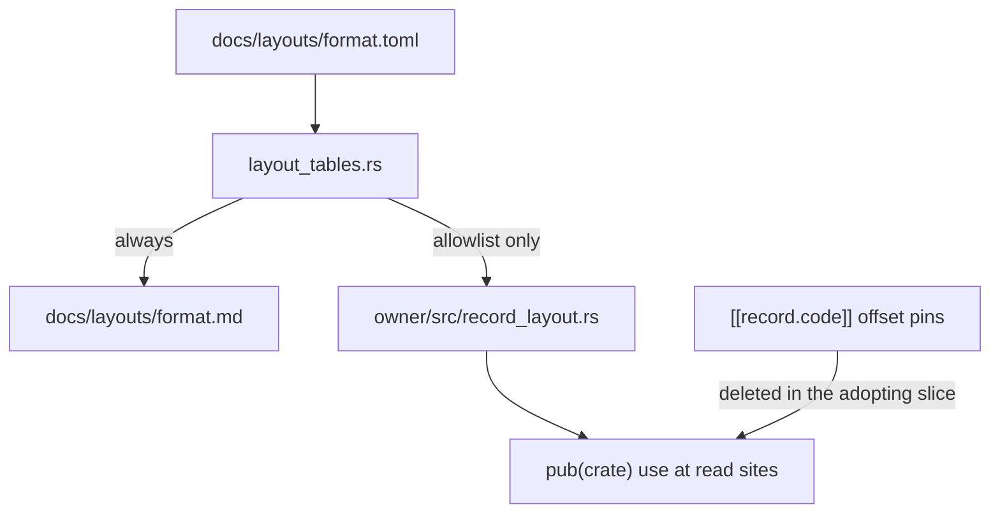

# refactor: Emit layout offset constants from the tables

## Summary

Emit named offset and size constants from `docs/layouts/*.toml` into per-codec `record_layout.rs` via the existing `layout_tables` harness. Adopt them at two exemplar sites (sldprt block scan, inventor RSe envelope). Reader generation stays cut. The generated filename is not `layout.rs`.

## Problem frame

The tables are the numeric oracle. Agents are told to read them before deriving an offset. Decoders still restate the numbers as literals and hand consts. The only decoder coupling is `[[record.code]]` substring pins. Inventor has 131 tabulated fields and one pin (`contains = "let header = bytes"`), against 4 golden files and a 68-arena decoder. A pin that does not mention 16 or 18 cannot catch a transcription slip.

Phase 8 cut generated readers. It did not say "code restates, pins suffice." Those are different ideas. This plan amends the recorded decision: the table stays the oracle; constants are generated; readers stay cut.

Conversion of an equal literal to a name does not verify the format. It cements current agreement, including agreed-wrong numbers, and makes later table edits flow into converted sites on regenerate. Spec anchors and tiling remain the check against the spec. Goldens remain the check against files. The win is one number, compiler-checked, at converted sites.

## Requirements

Oracle and generation:

- R1. Reader generation stays cut. No structs, builders, or typed accessors in this work.
- R2. For each allowlisted format, `crates/<owner>/src/record_layout.rs` is generated from that format's table and is byte-identical to a fresh emit in `cargo test -p cadmpeg --test layout_tables`.
- R3. The generated path is `record_layout.rs`. Never `layout.rs`. `crates/cadmpeg-codec-iges/src/layout.rs` and `crates/cadmpeg/src/inspect/layout.rs` stay hand-written.
- R4. Emission is allowlist-only. v1 writes sldprt and inventor. A format not on the list has no generated file and no `mod record_layout`.
- R5. Constants are `pub(crate)` offset and size `usize` values. Width and endianness live in doc comments. Relative bases are stated, not resolved.

Adoption and enforcement:

- R6. Each exemplar port is a literal-to-name substitution of equal values. `cargo test-fast` is green. Goldens are byte-identical. If the scanner is harder to read, the names are wrong.
- R7. `le_be_at_outside_core = 0` is documented as path-qualified only. A new key counts `use cadmpeg_core::le` / `be` imports. A new key counts offset-literal reads including aliased helpers.
- R8. Opening ratchet ceilings are measured by the new counters, not copied from a prior estimate.
- R9. In the slice that adopts a generated const, delete the offset-restating `[[record.code]]` pin and the hand const it replaces. Keep magic, tag, order, and mechanism pins.

Recording:

- R10. The phase-8 line in `AGENTS.md` and `CLAUDE.md` is amended in a commit that contains no codec port.
- R11. After the two exemplars, stop unless both ports read as a strict improvement. Do not extend the allowlist in that case.

## Key technical decisions

- KTD1. Committed generation through `crates/cadmpeg/tests/layout_tables.rs`, not compile-time macros. The harness already parses the full table model and already has regenerate-or-assert via `UPDATE_LAYOUT_DOCS=1`. One flag regenerates `.md` and allowlisted `record_layout.rs`.
- KTD2. Filename `record_layout.rs` / module `record_layout`. IGES already owns `mod layout` (`classify`, `Representation`). The CLI inspect crate owns another `layout.rs`. Reusing that name overwrites a decoder.
- KTD3. Allowlist in the harness, not "every byte-record format." Byte-record formats today: asm, catia, creo, f3d, freecad, iges, inventor, nx, rhino, sldprt (step is slot-only; sat has no table). Emitting all of them on day one edits every codec `lib.rs` and recreates worktree merge conflicts. v1 allowlist: `sldprt` → `crates/cadmpeg-codec-sldprt/src/record_layout.rs`, `inventor` → `crates/cadmpeg-codec-inventor/src/record_layout.rs`.
- KTD4. Constants only. Typed accessors are generated readers. Re-earn them on a width-mismatch bug, not in this work.
- KTD5. `pub(crate)`. No public-API-ledger row. If a second crate needs a number (inventor kernel / SAT / F3D SAB via `cadmpeg-asm`, Protein via `cadmpeg-protein`), that is an export decision for a later slice. v1 exemplars live in the owning crate.
- KTD6. Generated files carry `#![cfg_attr(rustfmt, rustfmt_skip)]` and `#![allow(dead_code)]`. The freshness test is byte-identical. rustfmt wrapping of spec-note doc comments would fight that test. `cargo fmt --all --check` then ignores the file.
- KTD7. Optional `const_name` on `[[record.field]]`. The emitter fails on an invalid ident or a collision with the record's `SIZE`. It does not slugify spec names. sldprt `tail_directory_entry.size` (offset 14) collides with `SIZE = 26` and is on the first exemplar's sibling path.
- KTD8. Offset-literal ratchet sees through aliases. `try_block` calls `u32_le(bytes, off + 14)` after `use cadmpeg_core::le::u32_at as u32_le`. A key that only matches `_at(` does not move when that site converts. Inventor RSe uses `bytes.get(..18)` and `View::u16_le_at(header, 16)`: count both `_at` literals and aliased helper literals. Slice-range sizes are a documented hold, not a silent miss.
- KTD9. Keep `le_be_at_outside_core` at 0 as a path-qualified tripwire. Add `le_be_alias_imports` for the 46 codec files (52 including `cadmpeg-asm`) that `use cadmpeg_core::le` / `be`. Do not treat 0 as "the pattern is gone."
- KTD10. Policy commit first, then emitter, then ports. The phase-8 amendment is a recorded-decision change and must be visible on its own.

## Scope boundaries

In v1:

- Allowlisted `kind = "byte"` records and, when present on an allowlisted format, `[[type]]` sizes.
- sldprt `container.rs` marker-scan family (`try_block`, `try_cache_cell`, `try_directory_entry`).
- Inventor `rse.rs` bulk envelope (`parse_bulk_stream` 18-byte header / form at +16).
- Schema `const_name`, harness allowlist, two generated files, two ratchet keys, docs.

Not in v1:

- Generated readers, structs, builders, accessors.
- Slot records, column records (IGES 1-based columns), gaps, `[[token]]` tag inventories.
- Formats off the allowlist, including asm (`sab_ref8` = 9 lives there).
- Test packers (`push_indexed_header` and similar).
- Exporting `record_layout` from `cadmpeg-asm` or `cadmpeg-protein`.
- Pre-commit expansion so a table-only edit runs `layout_tables` (existing docs-only skip; CI/`cargo test-fast` still runs the test).
- A ban on remaining offset literals. The count will not reach zero: untabulated structures and heuristic scans remain.

### Deferred to follow-up

- Per-codec allowlist extensions, one codec per series, coordinated with the worktree that owns that codec.
- `[[token]]` tag consts in match arms, after the first slice proves the constant shape.
- Cross-crate use of generated numbers (public export vs duplication). That decision is required before an asm or protein slice.

## High-level design



Allowlist check is in the harness. A format with byte records and no allowlist entry is valid: no `record_layout.rs`, no staleness assert.

v1 crate map:

| Table stem | Owning crate           | Generated path                                       |
| ---------- | ---------------------- | ---------------------------------------------------- |
| sldprt     | cadmpeg-codec-sldprt   | `crates/cadmpeg-codec-sldprt/src/record_layout.rs`   |
| inventor   | cadmpeg-codec-inventor | `crates/cadmpeg-codec-inventor/src/record_layout.rs` |

Future rows (not emitted now): asm → `cadmpeg-asm`; freecad → `cadmpeg-codec-freecad`; f3d, catia, creo, nx, rhino, iges → the matching `cadmpeg-codec-*`. IGES still emits `record_layout.rs`, never `layout.rs`.

## Generated artifact

Shape (sldprt `block_frame_header`):

```rust
//! GENERATED from docs/layouts/sldprt.toml — DO NOT EDIT.
//! Regenerate: UPDATE_LAYOUT_DOCS=1 cargo test -p cadmpeg --test layout_tables
#![cfg_attr(rustfmt, rustfmt_skip)]
#![allow(dead_code)]

/// `block_frame_header` (26 B) — docs/formats/sldprt.md §1.1 —
/// "Fixed prefix only. `preamble[pre_sz]` and `payload[comp_sz]` follow …"
pub(crate) mod block_frame_header {
    pub(crate) const SIZE: usize = 26;
    /// `type_id` — u32 LE at +6 — anchor: "type_id u32 LE"
    pub(crate) const TYPE_ID: usize = 6;
    /// `crc32` — u32 LE at +10
    pub(crate) const CRC32: usize = 10;
    pub(crate) const COMP_SZ: usize = 14;
    pub(crate) const UNCOMP_SZ: usize = 18;
    pub(crate) const PRE_SZ: usize = 22;
}
```

Call site: `use crate::record_layout::block_frame_header as hdr;` then `off + hdr::COMP_SZ`.

Rules:

- Offsets and sizes only. Record `SIZE` is the table `size`. Field offsets keep table names, uppercased (`type_id` → `TYPE_ID`), unless `const_name` is set.
- Module doc states the relative base when the table note says the offsets are not file-absolute. Callers write `scope_at + decal::MAPPING_MODE`. v1 exemplars are marker-relative / slice-prefix; this matters when f3d is allowlisted.
- `[[record.discrepancy]]` notes render into the module doc.
- Emitter fails if two consts in one record share a name, if a field name is not a Rust ident after the uppercasing rule, or if a field const would be `SIZE`.
- `[[type]]` sizes, when the allowlisted table has them: `SAB_REF8_BYTES = 9`. sldprt and inventor have no `[[type]]` rows; that path is tested when asm or nx is allowlisted.

## Ratchet

Production filter unchanged (`docs/convergence-ledger.toml` `filter`).

| Key                     | Meaning                                                                                                                                                                                                                                                                 | v1 action                                                                                                                                                                             |
| ----------------------- | ----------------------------------------------------------------------------------------------------------------------------------------------------------------------------------------------------------------------------------------------------------------------- | ------------------------------------------------------------------------------------------------------------------------------------------------------------------------------------- |
| `le_be_at_outside_core` | Path-qualified `le::*_at` / `be::*_at` call sites, not `use` lines                                                                                                                                                                                                      | Keep. Ceiling 0 is correct for that pattern. Document it as path-qualified.                                                                                                           |
| `le_be_alias_imports`   | Production files under `crates/cadmpeg-codec-*/src` and `crates/cadmpeg-asm/src` with `use cadmpeg_core::le` or `use cadmpeg_core::be` (including `{ le, be }`)                                                                                                         | New. Measure on landing. Prior count: 46 codec files, 6 asm files. Ratchet down toward `View::*_at`.                                                                                  |
| `offset_literal_reads`  | Production codec+asm reads whose offset argument is a decimal literal or `expr + decimal` / `decimal + expr`, including (1) identifiers ending in `_at` and (2) identifiers the same file imported from `cadmpeg_core::le` or `cadmpeg_core::be` (with or without `as`) | New. Measure on landing. A prior `_at`-only estimate of 759 did not match the tree (about 655 one-line `_at` plus/lit in codec crates, plus 164 aliased `off + N`). Do not paste 759. |

`offset_literal_reads` will not reach zero. Untabulated structures and heuristic stride scans stay. Deliberate holds go under `[reasons]`.

Slice-range sizes (`.get(..18)`, `.get(16..)`) are not in the key in v1. Record that hold under `[reasons]` for `offset_literal_reads`. The inventor exemplar converts `get(..18)` anyway; the ratchet is allowed not to see it.

Add unit tests in `scripts/test_convergence_ratchet.py` for: path-qualified `le::u32_at` still counts on `le_be_at_outside_core`; `use cadmpeg_core::le::u32_at as u32_le` plus `u32_le(b, off + 14)` counts on `offset_literal_reads` and `le_be_alias_imports`; a `use` line alone does not count on `le_be_at_outside_core`.

## Pin and const deletions

Audit pins in the adopting slice only. Do not sweep all 156 in v1.

Delete when `contains` restates an offset, size, or `const … = N` that the site now names from `record_layout`. Examples that die with the sldprt port: `const BLOCK_HEADER_LEN: usize = 26;`.

Keep when the pin is magic bytes, a tag map, order, or mechanism. Examples that stay: sldprt `pub const MARKER: [u8; 6] = …`; inventor `let header = bytes` (it does not mention 16 or 18).

Offset-restating pins are a large minority of 156, not a majority. Token, GUID, and function-name pins stay until a later mechanism can express them.

Hand consts: move callers to the generated name in the same slice. Do not leave `pub(crate) use record_layout::block_frame_header::SIZE as BLOCK_HEADER_LEN` unless a third file still needs the old name after the slice. Composed consts such as f3d `BODY_MAP_ZERO_PREFIX_LENGTHS = [10, 11]` stay codec-owned and, when f3d is allowlisted, are built from the two generated record modules.

## Implementation units

### U1. Record the phase-8 amendment

- **Goal:** Make the new contract visible in project memory before any generated file exists.
- **Requirements:** R10, R1, R3
- **Dependencies:** none
- **Files:** `AGENTS.md`, `CLAUDE.md`, `docs/layouts/README.md`
- **Approach:** Replace the phase-8 sentence in both memory files with: reader generation stays cut; allowlisted codecs emit offset/size constants into `src/record_layout.rs` from the tables; regenerate with `UPDATE_LAYOUT_DOCS=1 cargo test -p cadmpeg --test layout_tables`; never edit `record_layout.rs` by hand; never use the filename `layout.rs` for this artifact. README gains the generated-artifact contract, the allowlist rule, `const_name`, and the rustfmt-skip note. No ledger numbers in this commit (counters do not exist yet). No codec `src` changes.
- **Test expectation:** none — docs only. Pre-commit skips the Rust gate on a docs-only commit, which is existing behavior.
- **Verification:** The three files state the same filename, allowlist, and regenerate command. `crates/cadmpeg-codec-iges/src/layout.rs` is not named as an emit target.

### U2. Emitter, schema, allowlist, ratchet

- **Goal:** Generate two `record_layout.rs` files, refuse to touch any other crate's `layout.rs`, and land honest ledger keys.
- **Requirements:** R2, R3, R4, R5, R7, R8
- **Dependencies:** U1
- **Files:** `crates/cadmpeg/tests/layout_tables.rs`, `docs/layouts/README.md` (schema `const_name`), `docs/layouts/sldprt.toml` (`tail_directory_entry.size` `const_name`), `crates/cadmpeg-codec-sldprt/src/lib.rs`, `crates/cadmpeg-codec-sldprt/src/record_layout.rs` (generated), `crates/cadmpeg-codec-inventor/src/lib.rs`, `crates/cadmpeg-codec-inventor/src/record_layout.rs` (generated), `scripts/convergence-ratchet.py`, `scripts/test_convergence_ratchet.py`, `docs/convergence-ledger.toml`
- **Approach:** Extend `Field` with optional `const_name` (`#[serde(default)]`, `deny_unknown_fields` still holds). Hardcode the two-row allowlist. Emit only `kind = "byte"` records and `[[type]]` sizes. Fail loud on ident/collision. `UPDATE_LAYOUT_DOCS=1` writes `.md` and allowlisted `record_layout.rs`. Normal mode asserts byte identity; missing allowlisted file is a failure. Add `mod record_layout;` as `pub(crate)` in the two codec `lib.rs` files (sldprt already uses a mix of `mod` / `pub(crate) mod`; inventor uses private `mod`). Do not add the module to other crates. Implement `le_be_alias_imports` and `offset_literal_reads`; measure; write ceilings; add `[reasons]` for the slice-range hold on `offset_literal_reads`.
- **Patterns to follow:** `render()` and `rendered_layout_pages_match_the_tables` in `layout_tables.rs`; `METRIC_KEYS` plus `scripts/test_convergence_ratchet.py`.
- **Test scenarios:**
  - Allowlisted sldprt/inventor: committed `record_layout.rs` matches emit.
  - Format not on the allowlist (for example catia): no `record_layout.rs` required.
  - IGES: `crates/cadmpeg-codec-iges/src/layout.rs` is unchanged after regenerate.
  - Field `name = "size"` without `const_name` in a byte record that also emits `SIZE`: emitter error.
  - `const_name = "STORED_SIZE"` on sldprt `tail_directory_entry.size` emits `STORED_SIZE`, not `SIZE`.
  - Two fields that upper-case to the same ident: emitter error.
  - `use cadmpeg_core::le::u32_at as u32_le` plus `u32_le(b, off + 14)` increments `offset_literal_reads` and `le_be_alias_imports`.
  - Path-qualified `le::u32_at(b, 0)` still increments `le_be_at_outside_core`.
- **Verification:** `UPDATE_LAYOUT_DOCS=1 cargo test -p cadmpeg --test layout_tables` then a second run without the flag. `cargo test -p cadmpeg-codec-iges --all-targets` still compiles `layout::classify`. `python3 scripts/convergence-ratchet.py` is green. `cargo fmt --all --check` is green.

### U3. sldprt marker-scan exemplar

- **Goal:** Convert `try_block` and siblings to generated names without behavior change.
- **Requirements:** R6, R9
- **Dependencies:** U2
- **Files:** `crates/cadmpeg-codec-sldprt/src/container.rs`, `docs/layouts/sldprt.toml` (delete superseded pins only)
- **Approach:** `use crate::record_layout::block_frame_header as hdr` (and the cache-cell / tail-directory modules). `off + 14` becomes `off + hdr::COMP_SZ`. `BLOCK_HEADER_LEN` becomes `hdr::SIZE`. `try_directory_entry` uses `tail_directory_entry::STORED_SIZE` at +14. Delete the pin `contains = "const BLOCK_HEADER_LEN: usize = 26;"`. Keep the `MARKER` pin. Remove `const BLOCK_HEADER_LEN` from `container.rs`. Diff must show equal numbers.
- **Test scenarios:**
  - `try_block` / `try_cache_cell` / `try_directory_entry` compile against the generated consts.
  - `cargo test-fast` green; sldprt goldens unmodified (`git diff -- crates/cadmpeg-codec-sldprt/tests/golden` empty).
  - Remaining pin on `block_frame_header` is the marker bytes pin only.
- **Verification:** Reviewer can confirm every substituted value equals the old literal. Scanner is not harder to read than `off + 14`.

### U4. inventor RSe envelope exemplar

- **Goal:** Convert the 18-byte bulk header and form-at-16 to generated names. Prove the shape on the codec with the largest table/pin gap.
- **Requirements:** R6, R9
- **Dependencies:** U2
- **Files:** `crates/cadmpeg-codec-inventor/src/rse.rs`, `docs/layouts/inventor.toml` (keep the one pin)
- **Approach:** `parse_bulk_stream` uses `record_layout::bulk_envelope::SIZE` for the 18-byte prefix and `FORM` for offset 16. Keep `contains = "let header = bytes"`; it is not an offset restatement. This site is on the golden path (`rse_records` in `tests/golden/decode/primary.json`). A green result does not prove oracle coupling for the other 30 inventor records. It proves the constant shape on inventor.
- **Test scenarios:**
  - `View::u16_le_at(header, bulk_envelope::FORM)` and `bytes.get(..bulk_envelope::SIZE)` replace 16 and 18.
  - Inventor goldens unmodified. `cargo test-fast` green.
- **Verification:** Same equal-literal review as U3.

### U5. Kill-switch

- **Goal:** Decide whether to extend the allowlist.
- **Requirements:** R11
- **Dependencies:** U3, U4
- **Files:** none unless stopping (no extra files to revert beyond not adding allowlist rows)
- **Approach:** If either exemplar is harder to read than the literal form, stop. Leave the two generated files, the two `mod record_layout` lines, the harness, and the ratchet. Do not add formats. If both ports are a strict improvement, later slices may append one allowlist row per codec series.
- **Test expectation:** none — a go/no-go on the U3/U4 diffs.
- **Verification:** Written decision in the slice commit message that extends the allowlist, or no such commit.

## Risks

- Table typo plus regenerate plus converted site changes decode without a pin. That is the intended coupling. Goldens catch it only where they exist. Inventor remains thin (4 files). Do not convert thin records in the same slice as the envelope exemplar.
- `offset_literal_reads` will move slowly: most `_at` sites are untabulated or off-allowlist. A stalled count with no `[reasons]` update is the abandoned-mechanism detector.
- Active codec worktrees: U2 touches sldprt and inventor `lib.rs` only. Coordinate with whoever owns those crates. Do not emit into other codecs to "get ahead."

## Documentation notes

U1 is the docs commit. After U2, README regenerate instructions name both derived views:

```sh
cargo test -p cadmpeg --test layout_tables
UPDATE_LAYOUT_DOCS=1 cargo test -p cadmpeg --test layout_tables
```

Never edit `record_layout.rs` or `<format>.md` by hand.

## Sources

- Harness: `crates/cadmpeg/tests/layout_tables.rs` (`LayoutFile`, `render`, `rendered_layout_pages_match_the_tables`, `EXPECTED_FORMATS`).
- Collision: `crates/cadmpeg-codec-iges/src/layout.rs`, `crates/cadmpeg-codec-iges/src/lib.rs` (`mod layout`), `crates/cadmpeg/src/inspect/layout.rs`.
- Exemplars: `crates/cadmpeg-codec-sldprt/src/container.rs` (`try_block`, `BLOCK_HEADER_LEN`, `u32_le`); `crates/cadmpeg-codec-inventor/src/rse.rs` (`parse_bulk_stream`); `docs/layouts/sldprt.toml` `block_frame_header` / `tail_directory_entry`; `docs/layouts/inventor.toml` `bulk_envelope`.
- Inventor surface: `crates/cadmpeg-codec-inventor/src/validate.rs` `ARENAS` (68); `docs/golden-coverage-floors.toml` inventor = 4.
- Ratchet: `scripts/convergence-ratchet.py`, `docs/convergence-ledger.toml`.
- Phase 8 line: `AGENTS.md`, `CLAUDE.md`.
